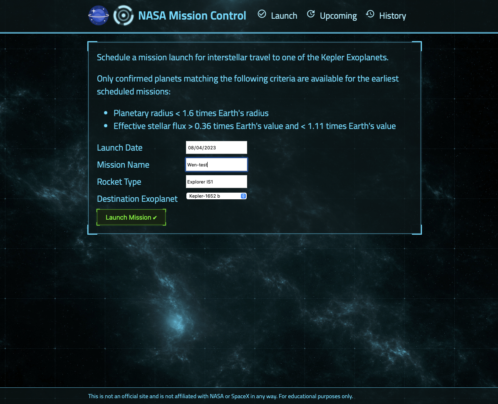
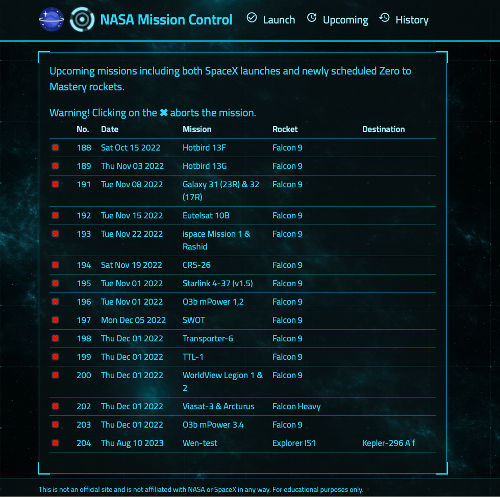
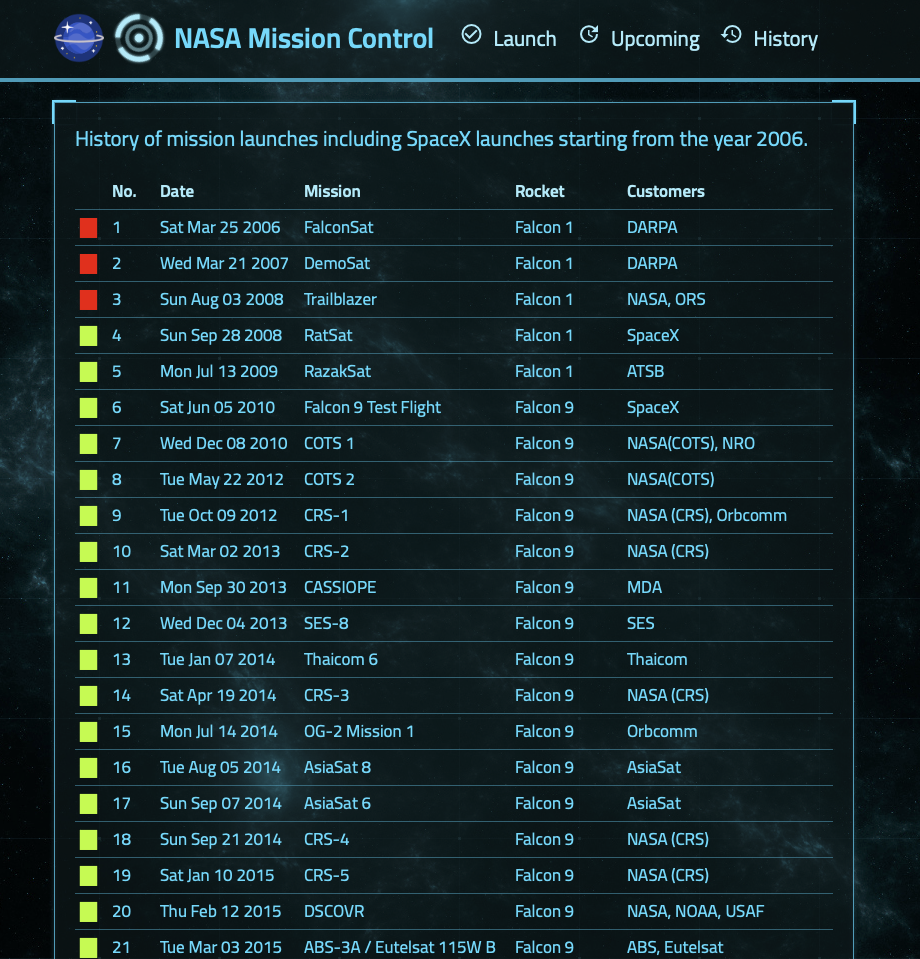
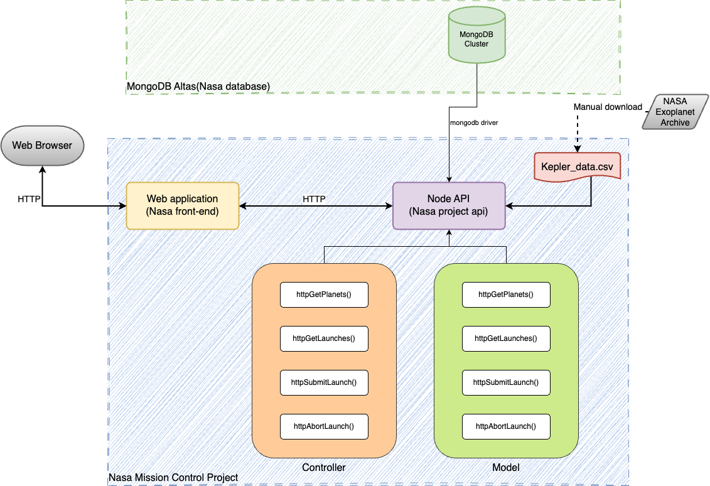
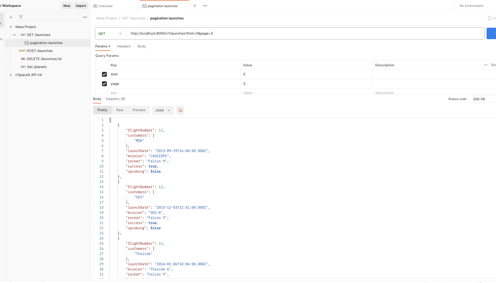
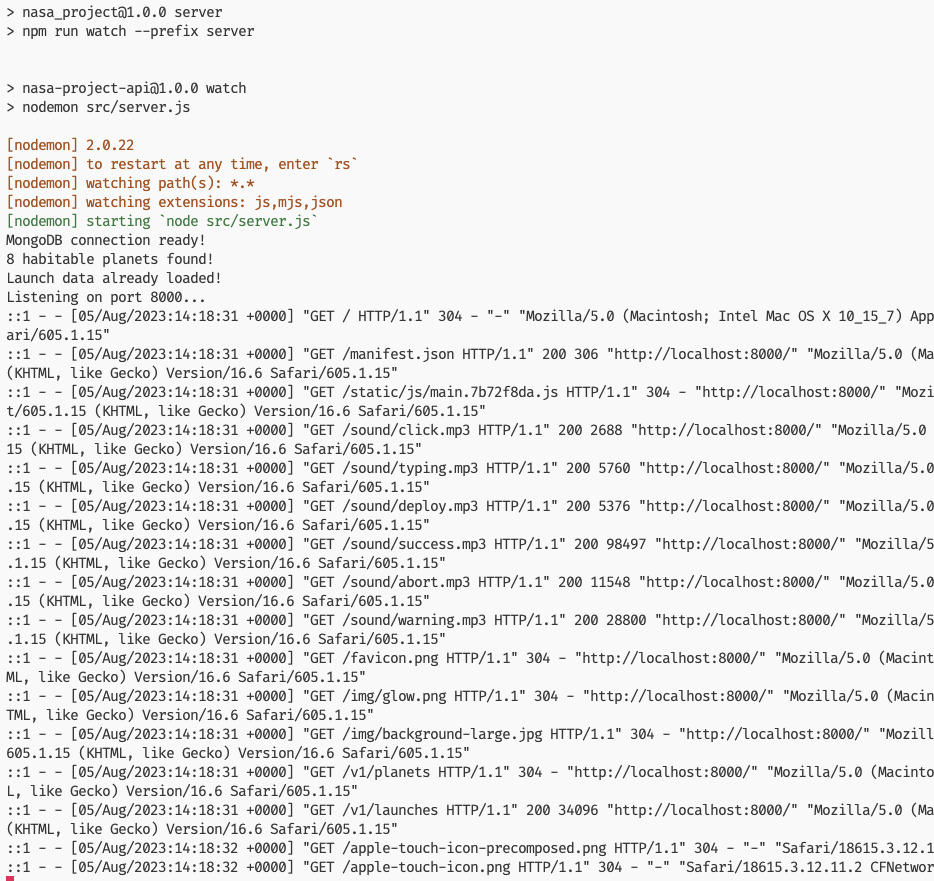
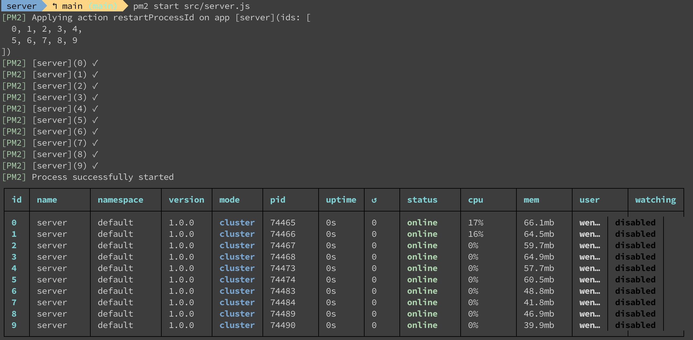

# Planet launch mission record
---

## Introduction

This application can record the launch mission about searching the habitable planets. Kepler planets are found by Kepler space telescope of NASA but only a few planets can be achieved the conditions of habitable planet. This application already downloaded [Kepler planets](https://exoplanetarchive.ipac.caltech.edu/docs/data.html) and filtered with the conditions of habitable planets.   

In this app, it also utilized SpaceX API to get previous data of rockets information, mission name and launched date. These data are integrated with this project and can know the history of launch mission and upcoming mission.
<br>

***Reference data***:
[NASA Exoplanet Archive website](https://exoplanetarchive.ipac.caltech.edu/index.html)
[SpaceX API](https://github.com/r-spacex/SpaceX-API)

<br>

## Application Feature
- #### *_Launch your personal mission_*
You can input your mission name, set the habitable planet which you want to investigate and launch date. 



- #### *_Check the upcoming mission_*
  In upcoming page, you can check your current customer mission and other missions in future. Also, you can cancel the mission.



- #### *_Check the history of mission_*
  When you cancel your mission, it will show in the history page. And you cna check the mission which is planed in the past. The symbol in red means that mission is canceled or failed. The green one is in success.



<br>

## Installation
To use this project, you have to follow these steps:
1. clone this repo to your local computer
   ```
   git clone https://github.com/wenliangsu/planet-launch-mission.git
   ```
2. Make sure you have MongoDB and set to the `.env` file in server folder. 
3. Run `npm install`
4. Run `npm run deploy` to implement the application and use the https://localhost:8000 to connect it.

If you want to use ***docker***, you follow these step:
1. Make sure you have installed the latest version of docker.
2. Run `docker build -t planet-launch-mission`
3. Run `docker run -it -p 8000:8000 planet-launch-mission`


<br>
## Technical Feature
- #### The architecture of project
After downloading the Kepler planet data from Nasa exoplanet archive with CSV file, it is converted to JSON format by the operation of file system in node.js. In this application,  the design pattern is used with MVC(model-view-controller). The project is separated by client side and server side. In view component, it is developed by the front-end system in client side. The others are developed by the back-end system in server side.

| | 
|:--:| 
| *The diagram of architecture* |

In the back-end system, the date of kepler planets are stored in MongoDB which already set the schema in model, and can be achieved from the controller. 


- #### RESTful API
  It is also deign the routes with RESTful API so that front-end development can concatenate this API to show the data in the page.
  
| | 
|:--:| 
| *RESTful API by postman* |

- #### The log and performance system of server
  This application provide the log system in server side by ***morgan*** package. It records that behavior of user who want to get or post the information from the server.

  For the performance of server, it use ***pm2*** package to monitor your server and even it can also record the server's log at the same time. You can run the following command at server folder in terminal:
  ```
  npm run cluster
  ```

| | 
|:--:| 
| *The logs of server* |

| | 
|:--:| 
| *the performance tool of pm2 package* |


<br>

### Contributor

_Wen Su_

<br>

##### *Resource of front-end (React)*
The front-end in this project was built by ZTM academy. It provided the clearly interface for development and data concatenation.